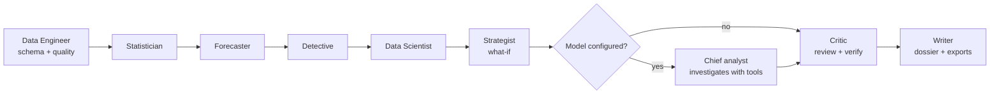

# The AI analyst team

Status: implemented and tested on deterministic fictional samples. See
[`capabilities.json`](../capabilities.json) (`agents.*`) for the exact verified scope.

BASEERA's analyst team does the complete job of a senior data analyst on any tabular dataset
a business uploads: it reads the data, audits it, measures it, tests it, forecasts it, explains
why it moved, finds what drives it, segments it, sizes the levers, recommends what to do, and
writes the report — in Arabic or English.

## Two rules the whole design serves

1. **Numbers come from deterministic tools.** A language model may plan, choose tools and
   write, but it never computes a published figure. Every figure is produced by reproducible
   Python (pandas, SciPy, statsmodels, scikit-learn) and stored as evidence with its method,
   arguments and sample size.
2. **Every figure a model writes is verified.** The critic extracts each number from model
   prose (Arabic or Latin digits, `%`, `K`/`M`/`ألف`/`مليون`) and checks it against the evidence.
   Figures that cannot be traced are flagged in the UI and exports; if too many are
   unverified the deterministic narrative is used instead.

## The team

| Agent | Owns | Tools |
| --- | --- | --- |
| Chief Analyst | Frames the question, plans, delegates, investigates, answers | all (via the tool loop) |
| Data Engineer | Semantic model (time, measures, dimensions, entities, outcomes), quality audit, readiness | `describe_dataset` |
| Statistician | Headline KPIs, distributions, correlations (BH-corrected), group tests with effect sizes, concentration | `headline_kpis`, `query_data`, `describe_columns`, `distribution`, `correlations`, `compare_groups`, `association`, `concentration` |
| Forecaster | Trend (Theil-Sen, Mann-Kendall), seasonality, level shifts, backtested forecasts with conformal intervals | `trend`, `forecast`, `seasonality_profile` |
| Root-cause Detective | Exact contribution analysis, mix/rate decomposition, two-level root-cause path, noise check, anomalies in time and records | `explain_change`, `series_anomalies`, `record_anomalies` |
| Data Scientist | Key-driver models (CV tournament, grouped permutation importance, leakage guards), segmentation, RFM, cohorts | `key_drivers`, `segment`, `customer_value_tiers`, `cohort_retention` |
| Business Strategist | What-if on the strongest actionable lever, prioritised recommendations | `what_if` |
| Quality Reviewer (critic) | Re-grades confidence; verifies numbers; flags causal language | — |
| Report Writer | Executive summary, sections, exports | — |

## Full analysis (autopilot)

The playbook adapts to the data: an entity table with a churn flag is analysed around the
outcome; a transaction table around its money KPI; seasonal series are compared year over year
so seasonality is not mistaken for a problem; changes within the series' normal variation are
reported as such and do not create recovery recommendations.

Guards an expert would apply, built in:

- **Sibling outcomes** (profit and cost when explaining revenue) are excluded from driver models
  and reported, as are **arithmetic identities** (R² ≥ 0.995 linear combinations).
- A **dominant feature** (> 60 % of importance) triggers a second model without it, so a
  post-outcome field (e.g. satisfaction recorded after a return) cannot hide the real levers.
- **Price and quantity** are not sized as levers for a money target (mechanical, not behavioural).
- Group tests choose parametric or rank tests from the data, report effect sizes, and are
  corrected together with Benjamini-Hochberg.
- Forecasts publish holdout accuracy and whether they beat a naive benchmark; intervals are
  calibrated on residuals the model never saw.
- Record anomalies explain *why* (which values, how many robust deviations from typical).

## Engines

| Mode | When | What changes |
| --- | --- | --- |
| Claude (`anthropic`) | `BASEERA_ANTHROPIC_API_KEY` set, or `BASEERA_AGENT_PROVIDER=anthropic` | Chief analyst investigates with tools; writes the executive summary, "so what" per finding, sharpened recommendations; answers open questions via a tool loop |
| Local model (`ollama`) | `BASEERA_LLM_PROVIDER=ollama` + base URL | Same loop through Ollama function calling; nothing leaves the host |
| Expert engine (`deterministic`) | default without a model | Complete analysis and bilingual narrative from templates; questions routed by intent |

Claude requests use the official Anthropic SDK with adaptive thinking, configurable effort,
top-level prompt caching (stable system prompt and tool list), structured JSON output for the
report, and server-side refusal fallbacks (`BASEERA_ANTHROPIC_FALLBACKS=off` disables them).
Thinking and tool-use blocks are returned unchanged within a tool loop; all parallel tool results
are sent back in one user turn. Any provider failure falls back to the expert engine and is
shown to the user.

## Data sent to a model

Only: the column names, roles, types and missing rates; up to eight example labels per
low-cardinality dimension; the team's findings (aggregates); and compact digests of tool results
(charts, matrices and record-level context removed). Raw rows, connector credentials, session
tokens and file paths are never sent. Data values are marked as data, not instructions.

## API

| Method | Path | Purpose |
| --- | --- | --- |
| GET | `/api/v1/analyst/team` | Roster, active engine, tools, principles |
| GET | `/api/v1/analyst/workspace` | Datasets with latest version and last analysis |
| GET/POST | `/api/v1/analyst/samples[/{id}]` | Deterministic sample datasets (`retail_sales`, `customer_churn`) |
| POST | `/api/v1/analyst/runs` | Start `autopilot` or `question` (with optional `thread_id`) |
| GET | `/api/v1/analyst/runs/{id}?since=N` | Status, new events since N, result |
| POST | `/api/v1/analyst/runs/{id}/cancel` | Cancel a queued or running analysis |
| GET | `/api/v1/analyst/runs/{id}/export?format=pdf|docx|pptx|html|md|json&locale=ar|en` | Dossier export |
| GET | `/api/v1/analyst/threads?dataset_version_id=` | Conversation threads |

Runs are owned by the requesting user inside their tenant; stored results are re-served only
while the reader can still open the dataset version. A run re-checks the owner's membership and
permission when it starts. Runs execute on a bounded in-process pool (two workers, three active
runs per user) and persist their event log as they go; a restart marks unfinished runs as
interrupted. `BASEERA_AGENT_INLINE=1` runs synchronously (tests, scripts).

## Limits

- Analyses read up to 250,000 rows; model fitting samples 20,000 rows.
- The tool loop is capped by `BASEERA_AGENT_MAX_TOOL_CALLS` (default 12; half for the
  autopilot investigation).
- Drivers and what-if results are associations. The UI, dossier and exports say so.
- Validated on deterministic fictional samples. Results on real company data must be reviewed
  by the business before decisions are taken.
