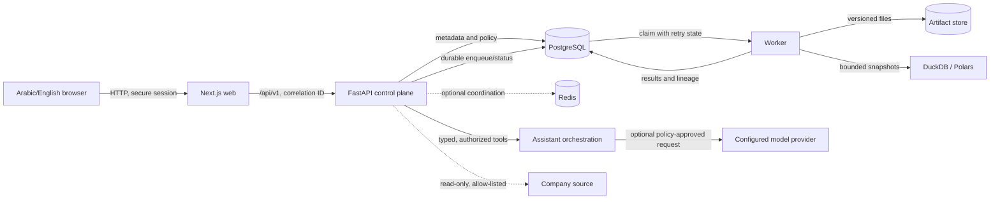

# BASEERA architecture

Status: implementation contract. Verification evidence is tracked in
[`evidence/README.md`](evidence/README.md); a diagram or statement here is not proof that its gate
has passed.

## Shape of the system

BASEERA is a tenant-aware modular monolith with separate web, API, worker, persistence, and
artifact boundaries. The design keeps business definitions and authorization in one control plane
while moving potentially expensive or untrusted data work to bounded jobs.



The initial artifact adapter is a local durable volume. An S3-compatible adapter is a deployment
extension, not an implied current dependency. PostgreSQL is authoritative for users, permissions,
definitions, versions, jobs, decisions, and evidence metadata. The checked-in worker claims durable
database jobs; Redis is provisioned for future coordination but is not on the current job path and is
never the only record of a material job or decision.

## Runtime boundaries

| Boundary | Owns | Must not own |
| --- | --- | --- |
| Web (`apps/web`) | Navigation, localization, accessible rendering, previews, polling, user intent | Authorization decisions, trusted totals, connector secrets |
| API (`services/api`) | Sessions, policy checks, API contracts, semantic definitions, idempotency, persistent state | Unbounded analysis, arbitrary model-produced SQL/code |
| Worker | Durable-job claiming, bounded execution, retry/recovery state | Authentication policy, silent source mutation |
| PostgreSQL | Control-plane records and result metadata | Raw workbook blobs or Redis-only transient state |
| Artifact adapter | Immutable source/derived versions, exports, model artifacts | Permission decisions; access always passes through the API |
| Model provider adapter | Language generation after policy and tool execution | Direct credentials, unrestricted data access, authoritative calculations |

## Primary data flow

### Import to evidence-backed insight

1. The API authenticates the actor, validates tenant scope, file size, name, MIME/content, and an
   idempotency key.
2. The original upload receives a tenant-scoped object key and immutable dataset version metadata.
3. A persisted job profiles every selected sheet/table. Rejected records and partial coverage are
   explicit results, not silently discarded rows.
4. A cleaning preview binds rules to the original version and reports affected rows and
   reconciliation deltas. Applying accepted rules creates a new version and lineage edges.
5. Metric queries resolve a versioned definition, authorized joins, dataset version, filters,
   timezone, and currency context. The result envelope receives a stable result ID.
6. Dashboards, assistant answers, reports, and exports reference that result ID. They do not copy
   editable metric numbers into presentation state.

### Connected source

Connector discovery and credential validation are separate from activation. Supported connectors
use read-only credentials, explicit network allow-lists, schema mapping, checkpointed sync, and
idempotent upserts. A schema fingerprint change pauses dependent refreshes until mapping is
reviewed. Lack of real credentials remains `configuration_blocked`, not “connected.”

### Conversational analysis

The assistant carries tenant, actor, locale, dataset/module, filters, time range, timezone, and
conversation state. It can propose only typed tool calls. The server validates arguments and
permissions, executes deterministic calculations, stores tool/result lineage, and returns evidence
references. Material edits are previewed and accepted with optimistic version checks. Ambiguity,
missing data, denied access, and unavailable providers are distinct outcomes.

## Control plane and execution isolation

- Every tenant-owned row contains `tenant_id`; every artifact key begins with a non-guessable,
  server-derived tenant namespace. IDs received from a client are never sufficient authorization.
- A request policy context contains tenant, user, role, department scopes, protected-field grants,
  and permission revision. Repositories and result retrieval require that context.
- Cache keys include tenant, permission revision, metric version, data version, normalized filters,
  timezone, and currency. Permission or source-version changes invalidate affected entries.
- Workers receive opaque job IDs and resolve current permissions before reading inputs or publishing
  results. Schedules re-evaluate their owner's authority at execution time.
- Parsers and analytical calls have file, row, memory, runtime, query, and concurrency budgets.
  Generated SQL is never executed without parsing/allow-list validation and server-owned bindings.
- Provider adapters receive only policy-approved fields and never connector credentials, session
  tokens, raw authorization objects, or unrestricted filesystem paths.

## Version and evidence invariants

```text
original dataset version
  -> profile
  -> cleaning preview
  -> published cleaned version
  -> semantic metric definition version + authorized scope
  -> analysis result ID
  -> chart/dashboard/report/export evidence references
```

Published source and cleaned versions are immutable. Dashboard and report edits create versions;
rollback creates a new head pointing to prior content rather than rewriting history. An evidence
reference records tenant, result ID, metric version, dataset version, filters, generated time,
source freshness, warnings, and access classification. Historical artifacts are still checked
against current access at retrieval time.

## API conventions

- Prefix: `/api/v1`.
- Long work returns a persisted job ID and a truthful queued/running/succeeded/failed/cancelled
  state; progress is shown only when measured.
- Retriable mutations require idempotency keys. Versioned edits require the expected current
  version and fail on conflicts.
- Collection endpoints are paged. Filters and sort fields are allow-listed and schema validated.
- Errors use stable codes for `unsupported`, `not_configured`, `insufficient_data`, `denied`,
  `conflict`, `validation_failed`, and `failed`, plus a correlation ID. Stack traces and secrets do
  not enter client responses.

## Failure and recovery

Jobs write checkpoints after durable boundaries. A retry reuses the idempotency key and cannot
publish a duplicate version. Interrupted ingestion retains the original plus an inspectable failed
job; it does not make a partial version current. Provider failure preserves deterministic tool
results and exposes retry/continue-without-narrative options. Source staleness is attached to every
affected result.

## Deployment topology

The checked-in Compose topology contains PostgreSQL, an optional Redis coordination service, API,
worker, and web services with durable database and artifact volumes. The current queue is stored in
PostgreSQL; the Redis volume is not queue evidence. This is a local/private-host baseline. It does not by
itself provide TLS, secret management, database high availability, or production network policy.
See [`deployment.md`](deployment.md) and [`security.md`](security.md).

## Decisions

Architectural choices are indexed under [`adr/README.md`](adr/README.md). The principal choice is
recorded in [ADR-0001](adr/0001-modular-monolith-and-isolated-jobs.md).
