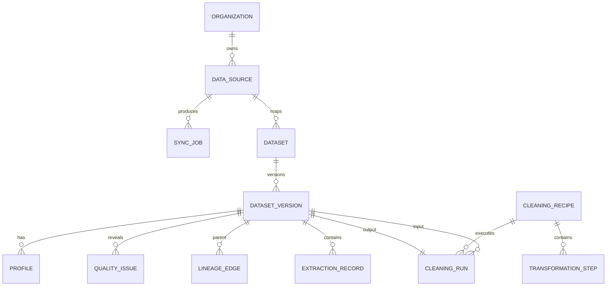

# BASEERA data model and lifecycle

This is the logical contract shared by persistence, APIs, workers, and evidence. Physical tables may
combine small entities, but they must preserve the identifiers, tenant boundaries, and version
semantics below. Migration files and generated API schemas are authoritative for what is currently
implemented.

## Identity and tenancy

Every tenant-owned record has a server-assigned opaque `id` and `tenant_id`. Externally sourced
business keys are represented by `(tenant_id, source_id, source_namespace, source_key)`; a raw
source key is never globally unique and is never an authorization grant.

| Entity | Purpose | Required relationships |
| --- | --- | --- |
| Organization | Tenant and reporting defaults | has memberships, sources, definitions, artifacts |
| User | Human/login identity, not a tenant membership | joins organizations through membership |
| Membership | Role and lifecycle in one organization | organization, user, role, permission revision |
| Role / access policy | Allowed actions, row/department scope, protected fields | evaluated server-side on each operation |
| Department scope | Hierarchical business scope with effective dates | membership/policy and department |
| Session | Revocable authenticated session | user, active organization, expiry, revocation time |

An administrator may manage configuration without automatically receiving protected HR fields.
Tenant predicates and field projection apply at the repository/query layer; UI navigation is only a
convenience and does not enforce access.

## Source, dataset, and transformation entities



- **Data source**: type, display name, state, owner, sensitivity, capabilities, health, and secret
  reference. It stores no plaintext credential.
- **Connector configuration**: schema-validated non-secret options and encrypted-secret reference.
- **Sync job/checkpoint/schema version**: durable cursor/watermark, source schema fingerprint,
  attempted and committed counts, rejection summary, timestamps, retry lineage, and status.
- **Dataset**: stable logical identity, owner, classification, source, and current published version.
- **Dataset version**: immutable object references, content hash, schema, row counts, coverage,
  parent version, creation cause, creator/job, and publication state.
- **Extraction record**: sheet/table/range/member, source row identity, parse status, and quarantine
  reason. This distinguishes full, selected, preview, and sample scope.
- **Profile / quality issue**: version-bound column statistics and typed findings with severity,
  examples, affected count, checks performed, and limits.
- **Cleaning recipe / step / run**: ordered typed operations, reviewed parameters, preview summary,
  affected rows, reconciliation values, reviewer, and immutable output version.
- **Lineage edge**: typed relationship between source, derived dataset, result, chart, report, or
  export, including the operation/version responsible.

The original upload is immutable. A preview never mutates data. Apply and rollback both create new
published versions so prior evidence remains reproducible.

## Semantic layer

| Entity | Contract |
| --- | --- |
| Business entity | Canonical entity type plus source mappings and effective dates |
| Relationship | Typed, directional edge with cardinality, source evidence, confidence, and access label |
| Glossary term | Localized name/description, synonyms, owner, status, and version |
| Metric definition/version | Stable metric ID, formula, grain, unit, dimensions, filters, time and missing-data policy |
| Approved join | Left/right entities, keys, cardinality, validity range, fan-out guard, and approver |
| Semantic mapping | Versioned mapping from source fields/values to canonical concepts |

Metric definitions are immutable once approved; a change produces a new version with effective
dates. Queries bind to one version explicitly or resolve the version effective for their reporting
cutoff. Joins not in the approved graph are rejected.

## Company entities and joins

Canonical records include customers/contacts/opportunities/activities, employees/departments/roles/
skills/assignments, projects/tasks/milestones, suppliers/orders/invoices/expenses, support cases,
objectives/targets, and process events/objects.

Join rules:

- Transactions join a business entity through canonical mapping plus source namespace; display
  names are never join keys.
- Slowly changing department, role, ownership, and currency mappings are resolved at the fact's
  effective timestamp, not at query time's current value.
- Many-to-many relationships require a bridge with effective dates and an allocation rule. A query
  that would fan out totals without an approved allocation fails validation.
- Distinct counts state their identity key. Employee and customer records from different systems
  are not merged solely by similar names or email fragments.
- Protected employee attributes remain separately classified and projected only for authorized
  roles; aggregate disclosure thresholds apply before publication.

## Analysis and artifact entities

```text
AnalysisRun -> ToolExecution -> StructuredResult -> Finding / ChartSpecification
                                      |-> DashboardVersion
                                      |-> ReportVersion -> Export
ModelRun -> Backtest -> Forecast
Scenario -> OptimizationRun / SimulationRun / CausalRun
Conversation -> Message -> proposed change -> Approval -> published version
Decision -> evidence references + owner + review date + observed outcome
```

An analysis run records actor/policy revision, intent, normalized scope, tools, timing, warnings, and
status. A structured result stores typed columns/values or an artifact pointer, query/metric and data
versions, filters, timezone/currency, freshness, and a reproducibility hash. Presentation artifacts
reference results rather than inventing independent values.

Dashboard and report records are stable containers; each edit creates a version with parent,
author, accepted diff, result dependencies, locale, and timestamps. Exports bind to a specific
version and permission snapshot but are re-authorized when downloaded.

## Operational entities

- **Job**: tenant, kind, input references, state, measured progress, attempt, idempotency key,
  timestamps, cancellation request, error code, correlation ID, and result references.
- **Conversation/message**: actor scope, locale, context snapshot, content classification, typed tool
  calls, result/evidence IDs, and redacted diagnostic metadata.
- **Action proposal/approval**: proposed typed mutation, before/after diff, consequence summary,
  submitter, reviewer, current state, expiry, and idempotent execution reference.
- **Decision**: problem, evidence, options, chosen action, owner, due/review dates, success metric,
  expected and later observed outcome.
- **Schedule/notification**: owner, timezone-aware recurrence, next run, permission revision, cooldown,
  delivery target, attempts, and pause/cancel state.
- **Audit record**: actor, tenant, action, resource, outcome, policy revision, correlation ID, time,
  and redacted metadata. The current design does not claim cryptographic immutability.
- **Evaluation case/result**: suite version, split, input context, expected category/evidence, provider,
  attempt, measured outputs, grader decisions, latency/cost, and final denominator bucket.

## Time, currency, and nulls

- Persist instants in UTC and preserve the source offset/timezone when supplied. Resolve business
  periods in the organization's IANA timezone (demo: `Asia/Amman`).
- Store dates without time only when the business concept is a date. Never convert a date-only value
  through UTC midnight.
- Monetary values use fixed decimal amounts and an ISO 4217 currency code. Aggregate only one
  currency unless a versioned exchange-rate source and conversion policy are supplied.
- `null`, absent, redacted, not applicable, and zero are distinct. API result cells may carry a
  reason such as `missing_source`, `denied`, or `not_applicable`.
- Percentage ratios store a unitless decimal and identify numerator/denominator; presentation adds
  percent formatting.

## Lifecycle, retention, and deletion

Retention periods are deployment policy, not hard-coded promises. The dependency graph covers
originals, derived versions, indexes, caches, results, reports, exports, model artifacts, and
backups. A deletion request first tombstones the resource and blocks new retrieval, then schedules
authorized physical removal after dependency/retention review. Caches and retrieval indexes are
invalidated immediately. Existing shared exports are revoked where the storage adapter supports it.

Backup expiry is independent and documented to administrators. A restored backup must replay
revocations/deletions recorded after its snapshot before it is exposed. Legal-hold behavior, if
required, needs an explicit policy implementation and is not implied by this model.

